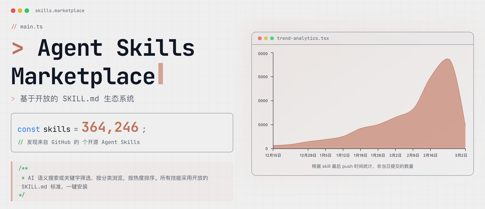
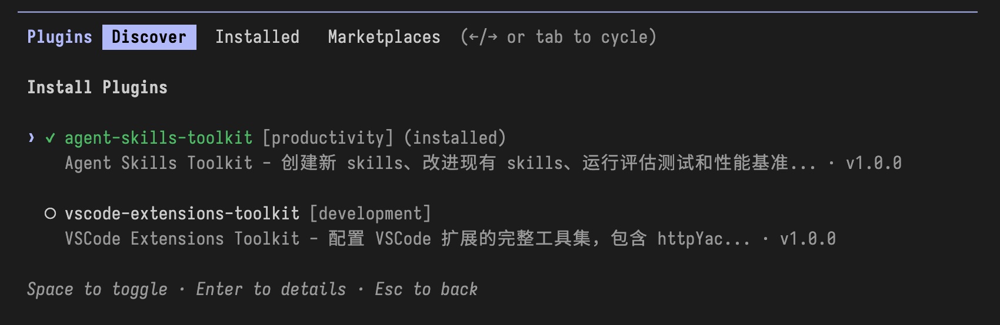

<div>
  <p align="center">
    <a href="https://platform.composio.dev/?utm_source=Github&utm_medium=Youtube&utm_campaign=2025-11&utm_content=AwesomeSkills">
    
    </a>
  </p>
</div>

<div>
  <p align="center">
    <a href="https://awesome.re">
      
    </a>
    <a href="https://makeapullrequest.com">
      
    </a>
    <a href="https://www.apache.org/licenses/LICENSE-2.0">
      
    </a>
  </p>
</div>

<div align="center">

简体中文 | [English](docs/README_EN.md) | [日本語](docs/README_JA.md) 

</div>

本项目致力于遵循少而精的原则，收集和分享最优质的 Skills 教程、案例和实践，帮助更多人轻松迈出搭建 Agent 的第一步。

> 欢迎关注我的 𝕏 账号 [@李不凯正在研究](https://x.com/libukai) ，以及 💬 微信公众号 [@李不凯正在研究](https://mp.weixin.qq.com/s/uer7HvD2Z9ZbJSPEZWHKRA?scene=0&subscene=90) ，即时获取 Skills 的最新资源和实战教程！

## 基本介绍

Skill 是一种轻量级的通用开放标准，通过打包专业知识和工作流程来扩展 AI 的特定能力。

当你需要执行可重复的任务时，你无需在每次和 AI 的对话中重复提供自己的流程、知识和偏好。只需将相关内容转化为 Skill，AI 便能自行学会相关的技能。

经过半年的发展和迭代，Skill 标准已得到各类 AI 产品的广泛支持，也成为了类 Claude Code 生态和类 OpenClaw 生态中增强个性化 AI 能力的标准方案。

## 标准结构

根据标准定义，每个 Skill 都是一个规范化命名的文件夹，其中集合了指令、脚本和资源，AI 通过在上下文中渐进式导入这些内容来理解和学习相关技能。

```markdown
my-skill/
├── SKILL.md          # 必需：说明和元数据
├── scripts/          # 可选：可执行代码
├── references/       # 可选：文档参考资料
└── assets/           # 可选：模板、资源
```

## 快速安装

### 类 Claude Code 生态



推荐使用 [skillsmp](https://skillsmp.com/zh) 商店，该商店中自动抓取了 Github 上的所有的 Skills 项目，并按照分类、更新时间、Star 数量等标签进行了整理。

可辅助使用 Vercel 出品的 [skills.sh](https://skills.sh/) 排行榜，直观查看当前最受欢迎的 Skills 仓库和单个 Skill 的使用情况。

对于特定的 skill，使用 `npx skills` 命令行工具可快速发现、添加和管理 skill，具体参数详见 [vercel-labs/skills](https://github.com/vercel-labs/skills)。

```bash
npx skills find [query] # 搜索相关技能
npx skills add <owner/repo> # 从指定 git 或本地路径添加技能
npx skills list # 列出已安装的技能
npx skills update # 升级技能
npx skills remove [skill-name] # 卸载技能
```

### 类 OpenClaw 生态


如果有科学上网的能力，且使用官方版本 OpenClaw，推荐使用官方的 [ClawHub](https://clawhub.com/) 商店，提供的技能更偏技术向且包含了大量海外产品的整合。

```bash
npx clawhub search "postgres backups"  # 搜索相关技能
npx clawhub install <skill-name> # 安装指定名称的技能
npx clawhub update --all # 升级技能
npx clawhub update --all --no-input --force # 强制升级技能
```


对于主要在国内网络环境下使用，或者是使用国内定制版的 OpenClaw，推荐使用腾讯推出的 [SkillHub](https://skillhub.tencent.com/) 商店，提供了大量更符合中国用户使用需求的技能。

首先，需要安装 Skill Hub CLI 工具，可以通过以下命令进行安装：

```bash
curl -fsSL https://skillhub-1251783334.cos.ap-guangzhou.myqcloud.com/install/install.sh | bash
```

安装完成后，可以使用以下命令来安装和管理技能：

```bash
skillhub search [query] # 搜索相关技能
skillhub install <skill-name> # 使用 skill name 添加技能
skillhub list # 列出已安装的技能
skillhub upgrade # 升级已安装的技能
```

## 技能创建

虽然可以通过技能商店直接安装和使用他人创建的技能，但是为了提升技能的适配度和个性化，更建议根据需要自己动手创建技能，或者在其他人的基础上进行微调。

以下是一些优质的技能创建资源，帮助你快速上手技能创作。

### 官方教程

-  @Anthropic: [Claude Skill 完全构建指南(中文版)](docs/Claude-Skills-完全构建指南.md)

### 技能创建

-  [skill-creator](https://github.com/anthropics/skills/tree/main/skills/skill-creator): 官方出品用于创建和优化 skill 的元技能，可快速创建和迭代个人专属的 skill。

## 优质教程

### 图文教程

-   @一泽 Eze：[Agent Skills 终极指南：入门、精通、预测](https://mp.weixin.qq.com/s/jUylk813LYbKw0sLiIttTQ)
-   @deeptoai：[Claude Agent Skills 第一性原理深度解析](https://skills.deeptoai.com/zh/docs/ai-ml/claude-agent-skills-first-principles-deep-dive)
-   @歸藏：[带动效的 PPT 生成 Agent！使用教学&创作思路](https://x.com/op7418/status/2010979152284041401)

### 视频教程

-   @马克的技术工作坊：[Agent Skill 从使用到原理，一次讲清](https://www.youtube.com/watch?v=yDc0_8emz7M)
-   @白白说大模型：[别再造 Agent 了，未来是Skills的](https://www.youtube.com/watch?v=xeoWgfkxADI)
-   @01Coder：[OpenCode + 智谱GLM + Agent Skills打造高质量智能开发环境](https://www.youtube.com/watch?v=mGzY2bCoVhU)

## 精选技能

### 官方项目

-   [agent-browser](https://github.com/vercel-labs/agent-browser/tree/main/skills): Vercel 出品的操控浏览器及应用的 Skills 集合
-   [anthropics](https://github.com/anthropics/skills)：Anthropic 出品的官方示例 Skills 集合
-   [better-auth](https://github.com/better-auth/skills)：Better Auth 出品的认证工具 Skills 集合
-   [black-forest-labs](https://github.com/black-forest-labs/skills)：Black Forest Labs 出品的操控 FLUX 模型的 Skills 集合
-   [browser-use](https://github.com/browser-use/browser-use/tree/main/skills)：Browser Use 出品的浏览器操作 Skills 集合
-   [cloudflare](https://github.com/cloudflare/skills)：Cloudflare 出品的 API 调用 Skills 集合
-   [clickhouse](https://github.com/ClickHouse/agent-skills)：ClickHouse 出品的数据库查询和分析 Skills 集合
-   [expo](https://github.com/expo/skills)：Expo 出品的 React Native Skills 集合
-   [firecrawl](https://github.com/firecrawl/cli)：Firecrawl 出品的 CLI 工具调用 Skills
-   [gemini](https://github.com/google-gemini/gemini-skills): Google Gemini 出品的 API/SDK 调用 Skills 集合
-   [huggingface](https://github.com/huggingface/skills)：HuggingFace 出品使用 Skill 训练大模型
-   [obsidian](https://github.com/kepano/obsidian-skills)：Obsidian CEO 出品增强 Obsidian 功能的 Skills 集合
-   [dify](https://github.com/langgenius/dify/tree/main/.claude/skills)：Dify 出品的多功能 Skills 集合
-   [microsoft](https://github.com/microsoft/agent-skills)：Microsoft 出品用于 Azure 服务的 Agent Skills 集合
-   [openclaw](https://github.com/openclaw/openclaw/tree/main/skills)：OpenClaw 官方 Skills 集合
-   [openai](https://github.com/openai/skills)：OpenAI 出品的官方 Skills 集合
-   [remotion](https://github.com/remotion-dev/skills)：Remotion 出品的使用 Remotion 创建视频内容
-   [replicates](https://github.com/replicate/skills)：Replicates 出品的调用 AI 模型的 Skills 集合
-   [slidev](https://github.com/slidevjs/slidev/tree/main/skills/slidev)：Slidev 出品的幻灯片制作 Skills 集合
-   [stripe](https://github.com/stripe/ai)：Stripe 出品的金融支付相关 Skills 集合
-   [sanity](https://github.com/sanity-io/agent-toolkit/tree/main/skills)：Sanity 出品的内容管理平台 Skills 集合
-   [supabase](https://github.com/supabase/agent-skills)：Supabase 出品的 PostgreSQL 最佳实践
-   [wordpress](https://github.com/WordPress/agent-skills)：WordPress 出品的内容管理平台 Skills 集合
-   [vercel](https://github.com/vercel-labs/agent-skills)：Vercel 出品的 React/Next Skills 集合


### 内容创作

-   [baoyu-skills](https://github.com/JimLiu/baoyu-skills)：宝玉的自用 SKills 集合，包括公众号写作、PPT 制作等
-   [libukai](https://github.com/libukai/awesome-agent-skills/tree/main/skills): 李不凯发布 Obsidian 相关工具 Skill
-   [op7418](https://github.com/op7418)：歸藏制作的一系列 Skills 集合，包括 PPT 制作、Youtube 分析等
-   [cclank](https://github.com/cclank/news-aggregator-skill)：cclank 制作的新闻聚合 Skill，能够自动抓取和总结指定领域的最新资讯
-   [huangserva](https://github.com/huangserva/skill-prompt-generator)：huangserva 使用 Skill 生成和优化 AI 人像文生图提示词的 Skill

### 编程辅助

-   [superpowers](https://github.com/obra/superpowers/tree/main/skills)：涵盖完整编程项目工作流程的 Skills 集合
-   [ui-ux-pro-max-skill](https://github.com/nextlevelbuilder/ui-ux-pro-max-skill)：面向 UI/UX 设计的 Skills 集合

### 产品使用

-   [teng-lin/notebooklm-py](https://github.com/teng-lin/notebooklm-py)：操控 NotebookLM 的 Skill
-   [czlonkowski/n8n-skills](https://github.com/czlonkowski/n8n-skills)：创建 n8n 工作流的 Skills 集合
-   [cloudai-x/threejs-skills](https://github.com/cloudai-x/threejs-skills)： 面向 Three.js 开发的 Skills 集合

### 其他类型

-   [coreyhaines31/marketingskills](https://github.com/coreyhaines31/marketingskills)：面向市场营销领域的 Skills 集合
-   [K-Dense-AI/claude-scientific-skills](https://github.com/K-Dense-AI/claude-scientific-skills)： 面向科研工作者的 Skills 集合


## 增强插件

在官方 skill-creator plugin 的基础上，本项目整合 [Claude Skill 完整构建指南](docs/Claude-Skills-完全构建指南.md) 中的最佳实践，构建了一个更为强大的 Agent Skills Toolkit ，帮助你快速创建和改进 Agent Skills。

**注意：该插件目前仅支持 Claude Code**

### 添加市场

启动 Claude Code，进入插件市场，添加 `libukai/awesome-agent-skills` 市场，也可以直接在输入框中使用以下指令添加市场：

```bash
/plugin marketplace add libukai/awesome-agent-skills
```

### 安装插件

成功安装市场之后，选择安装 `agent-skills-toolkit` 插件



### 快捷指令

插件中置入了多个快捷指令，覆盖了从创建、改进、测试到优化技能描述的完整工作流程：

- `/agent-skills-toolkit:skill-creator-pro` - 完整工作流程（增强版）
- `/agent-skills-toolkit:create-skill` - 创建新 skill
- `/agent-skills-toolkit:improve-skill` - 改进现有 skill
- `/agent-skills-toolkit:test-skill` - 测试评估 skill
- `/agent-skills-toolkit:optimize-description` - 优化描述

## 致谢


## 项目历史

[](https://www.star-history.com/#libukai/awesome-agent-skills&type=date&legend=top-left)
